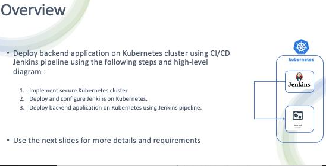
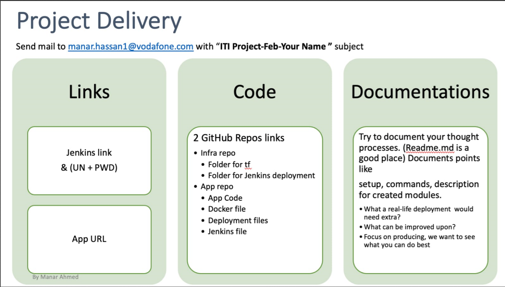
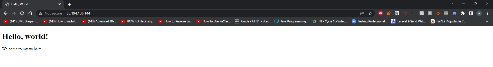

# Deploy backend application on K8S cluster using CI/CD jenkins pipline
## Project Requirement






## Tools:

- GCP CLI (Cloud Provider)
- Terraform (IaC)
- Docker (Containerization Application)
- Jenkins

## How to Use:

### Installation Guide:

1. Download or clone the repository to your local machine.

2. Install gcloud CLI, Terraform, and Docker on your local machine if you haven't already done so.

3. Authenticate to your user by running the command "gcloud init" and follow the instructions to log in to your Google Cloud Platform account and select the project you want to use

4. Navigate to the Terraform directory in the repository and initialize it by running the command "terraform init".

5. Make the necessary changes in the provider.tf file, specifically the project name and region, to match your own project settings.

6. Run the command "terraform plan" to review the infrastructure changes that Terraform will apply.

7. After reviewing the changes, run the command "terraform apply" to apply the changes to your infrastructure

Note: this guide assumes that you have a basic understanding of Docker, Terraform, and GCP Platform.
  
  
  
  
### Access VM:
1. To ssh into the vm-instance run this command \
`gcloud compute ssh --zone "<your zone>" "my-instance" --tunnel-through-iap --project "<you project name>"`

- Note: Install the necessary tools (gcloud CLI, kubectl, and Docker) on the instance where you want to deploy your DevOps tools.

2. Run the command to authenticate your user and generate a kubeconfig file for your Google Kubernetes Engine cluster. \
`gcloud container clusters get-credentials my-gke --region <your region> --project <your project name>`

3. Copy the setup files (Deployment.yml, k8s-SA.yml, deployment.yml, k8s-Service.yml, k8s-Volume.yml, and Agent Folder files) into the instance.

4. Run the command "kubectl create ns devops-tools" to create a new namespace for your DevOps tools.

5. Run the following commands to deploy the DevOps tools:

```
kubectl apply -f .
kubectl apply -f ./Agent
```

6. Run the command `kubectl get svc -n devops-tools` to get the IP address of the Jenkins service.

7. Run the command `kubectl exec -it po/jenkins-agent-<tail: pod name> -n devops-tools -- bash` to enter the Jenkins agent shell.

8. Run the command `passwd jenkins` to create a password for the Jenkins user.

9. Run the command `chmod 666 /var/run/docker.sock` to give the Jenkins user access to the Docker daemon.

10. Run the command `service ssh start` to start the SSH service on the Jenkins agent.

11. Install gCloud CLI

12. Run the command `su - jenkins` to switch to the Jenkins user.

13. Run the command 
`gcloud auth configure-docker` 
to authenticate your Docker client and allow it to push images to your private Google Container Registry (GCR) instance.

14. Finally, use the password you created for the Jenkins user to add the Jenkins agent to the list of Jenkins nodes, so that you can use it for your builds and deployments.


## Pictures:
### Access the Application


